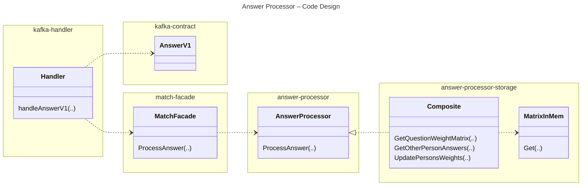
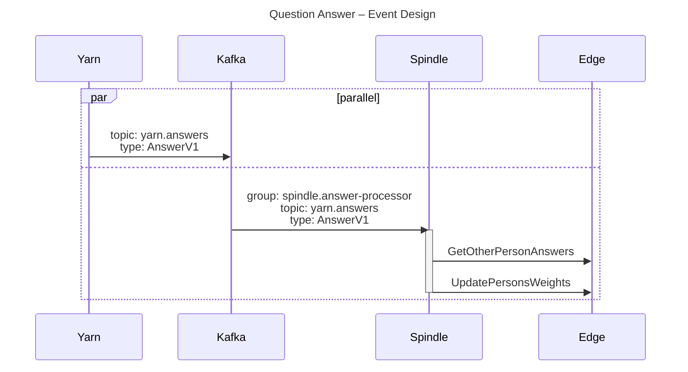
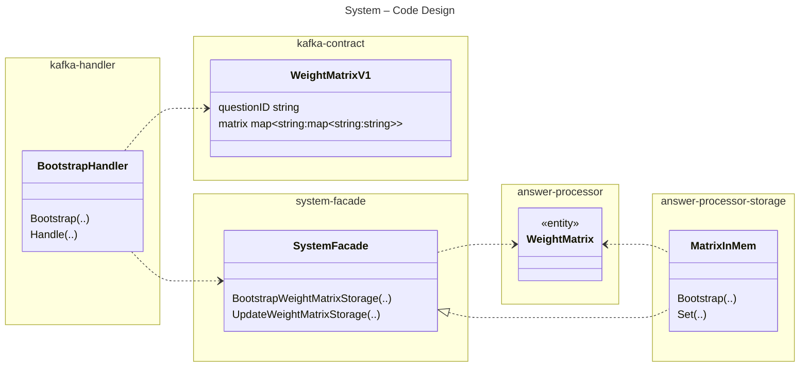
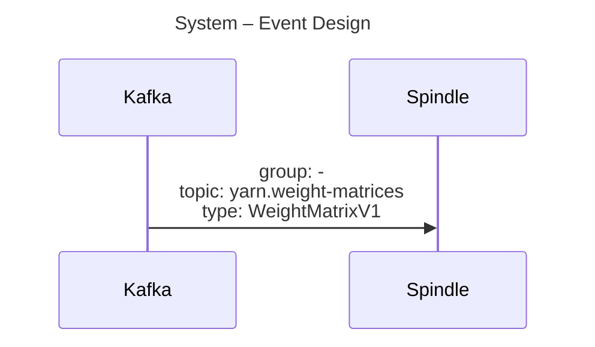

<!-- https://mermaid.js.org/syntax/classDiagram.html -->
<!-- https://mermaid.js.org/syntax/sequenceDiagram.html -->

```mermaid
---
title: Answer Processor – Code Design
---
classDiagram
    direction LR
    namespace kafka-contract {
        class AnswerV1 {
        }
    }
    namespace kafka-handler {
        class Handler {
            handleAnswerV1(..)
        }
    }
    namespace match-facade {
        class MatchFacade {
            ProcessAnswer(..)
        }
    }
    namespace answer-processor {
        class AnswerProcessor {
            ProcessAnswer(..)
        }
    }
    namespace answer-processor-storage {
        class Composite {
            GetQuestionWeightMatrix(..)
            GetOtherPersonAnswers(..)
            UpdatePersonsWeights(..)
        }

        class MatrixInMem {
            Get(..)
        }
    }

    Handler ..> AnswerV1
    Handler ..> MatchFacade
    MatchFacade ..> AnswerProcessor
    AnswerProcessor <|.. Composite
    Composite ..> MatrixInMem
```

```mermaid
---
title: Question Answer – Event Design
---
sequenceDiagram
    participant Yarn
    participant Kafka
    participant Spindle
    participant Edge

    par parallel
        Yarn ->> Kafka: topic: yarn.answers <br> type: AnswerV1
    and
        Kafka ->> Spindle: group: spindle.answer-processor<br> topic: yarn.answers <br> type: AnswerV1
        activate Spindle
        Spindle ->> Edge: GetOtherPersonAnswers
        Spindle ->> Edge: UpdatePersonsWeights
        deactivate Spindle
    end
```

```mermaid
---
title: System – Code Design
---
classDiagram
    direction LR
    namespace kafka-contract {
        class WeightMatrixV1 {
            questionID string
            matrix map~string:map~string:string~~
        }
    }
    namespace kafka-handler {
        class BootstrapHandler {
            Bootstrap(..)
            Handle(..)
        }
    }
    namespace system-facade {
        class SystemFacade {
            BootstrapWeightMatrixStorage(..)
            UpdateWeightMatrixStorage(..)
        }
    }
    namespace answer-processor {
        class WeightMatrix {
            <<entity>>
        }
    }
    namespace answer-processor-storage {
        class MatrixInMem {
            Bootstrap(..)
            Set(..)
        }
    }

    BootstrapHandler ..> WeightMatrixV1
    BootstrapHandler ..> SystemFacade
    SystemFacade ..> WeightMatrix
    WeightMatrix <.. MatrixInMem
    SystemFacade <|.. MatrixInMem
```

```mermaid
---
title: System – Event Design
---
sequenceDiagram
    participant Kafka
    participant Spindle
    Kafka ->> Spindle: group: - <br> topic: yarn.weight-matrices <br> type: WeightMatrixV1

```
